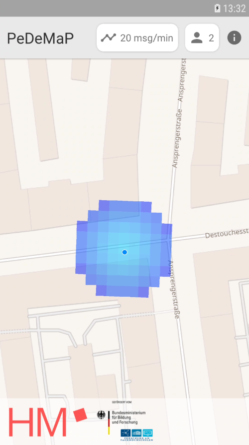
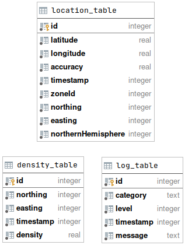
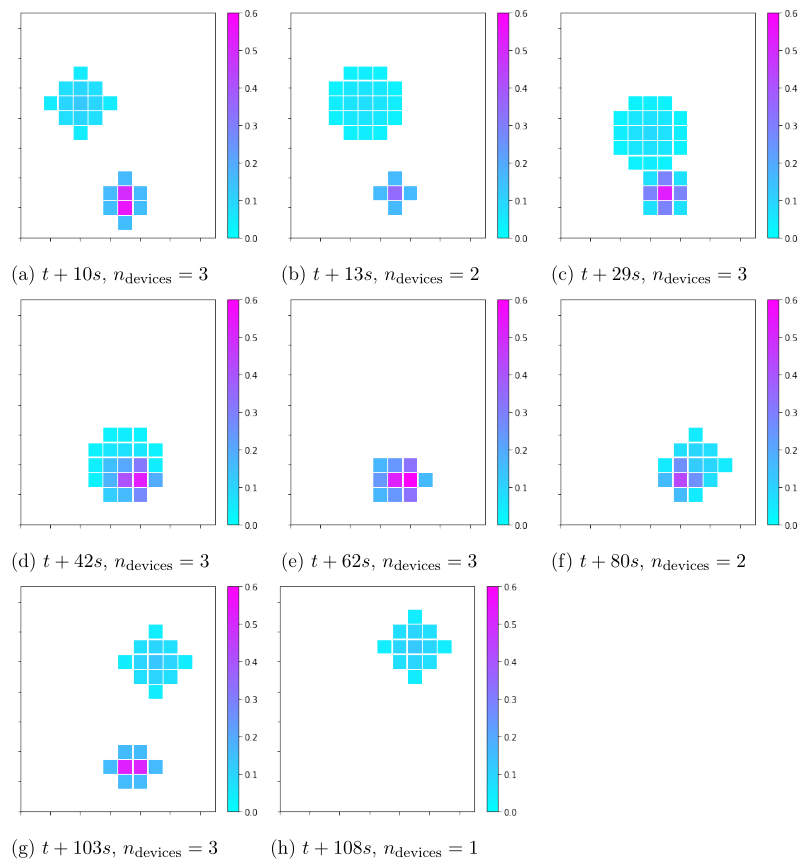

# PeDeMaP
PeDeMaP calculates and visualizes the crowd density in the surrounding area. 
This is achieved by exchanging location messages between the devices.
The application works without a centralized server and uses broadcast messages sent over a Wi-Fi network.

## Requirements
The following is required to run PeDeMaP:
- At least one Smartphone running Android 7.1 or newer
- Location access must be available on all devices
- _High Accuracy_ GPS must be allowed on the devices
- All devices must be connected to the same (WiFi-)network

## Density

The density is calculated by counting all devices in a grid cell. By default, the size of the cells is 5x5m.
If the received GPS data has low accuracy, the density of one device is spread over multiple cells
by using a normal distribution.
New strategies for density calculation can be achieved easily by implementing the interface `edu.hm.pedemap.density.strategy.DensityCalculationStrategy`.

## Networking

Location beacons are sent via the interface `wlan0` or `eth0` if available. PeDeMaP uses the 
broadcast IP address of the current sub-net.
UDP is used as the transport protocol, the destination port of all messages is `1510`.

## Building the protocol buffers
The structure of the data that is exchanged between the devices is defined in the _protocol buffers_
format in the file `app/src/main/proto/definitions.proto`.
Please not that all changes to this file could potentially break the compatibility with 
older versions of the app.
Kotlin code is generated from these definitions during the gradle build.

## Build variants
- demo_ui: The app's default UI, suited for demonstration purposes
- dev_ui: Contains a live log view and settings, suited for debugging

## Database
Log messages and density data are stored in a SQLite database for analysis.
The database is stored in `/data/data/edu.hm.pedemap/databases/default-database`.

## Sample scenario
These density maps were recorded using PeDeMaP in a scenario with 3 devices.

